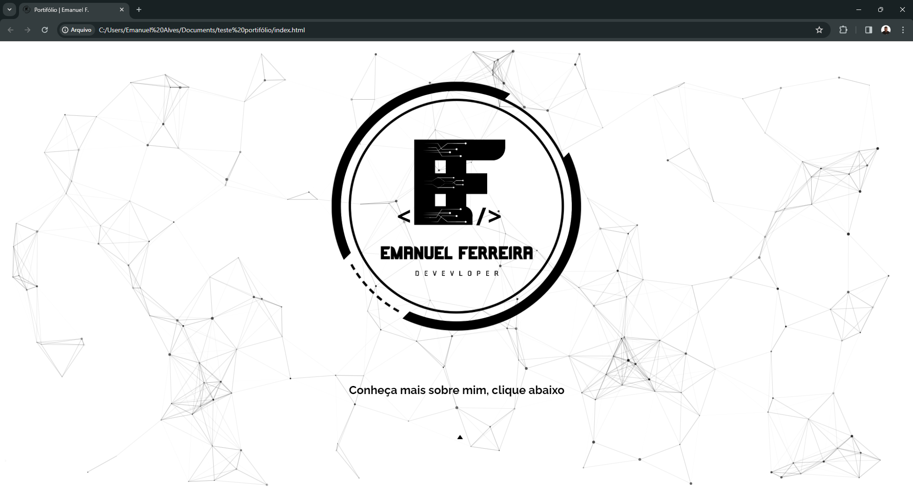
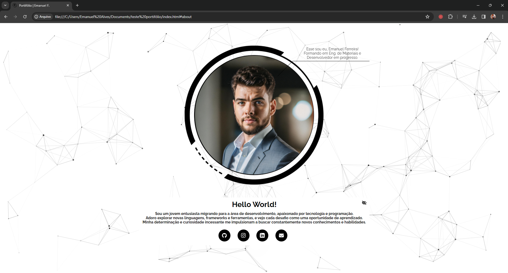

# Criação da minha página pessoal.
Utilizei HTML, CSS e JavaScript moderno para criação de design para minha página pessoal básica totalmente responsiva com efeitos de Partículas no fundo e algo bem simples e morderno. Utilizei CSS Flexbox, consultas de mídia para nosso design responsivo e transição CSS para alguns efeitos de animação interessantes. Também uma animação de pulso neste código!

# Screenshot
Aqui temos a captura de tela do projeto :

